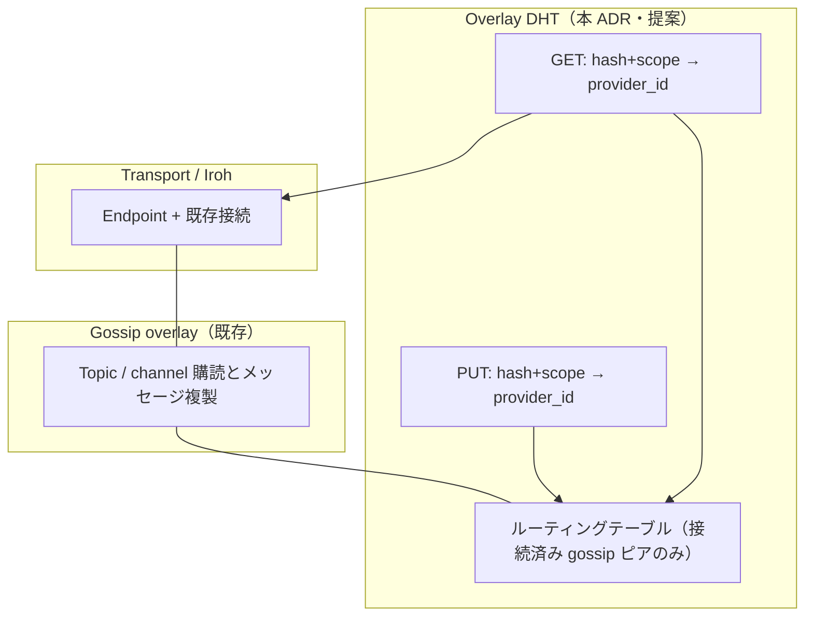
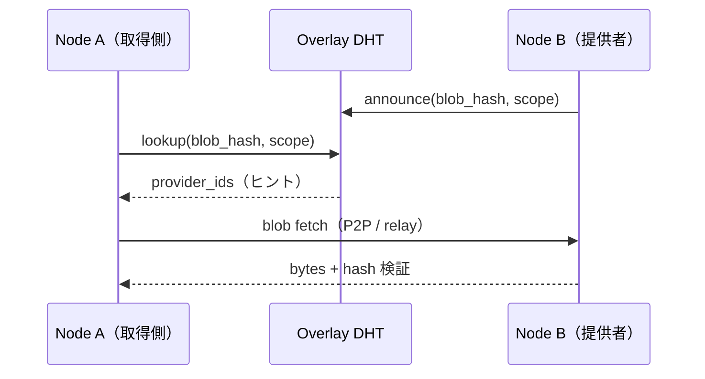

# ADR 0025: Gossip スコープ内オーバーレイ DHT による Blob 提供者索引（BlobAvailable 宣告の置換案）

## Status

Proposed

## Date

2026-05-11

## Base Branch

`main`

## Related

- `docs/adr/0024-blob-available-gossip-hint.md` — 置換対象の現行宣告仕様
- `docs/adr/0008-dht-discovery-data-classification.md` — エンドポイント発見用 seeded public/mainline DHT（本 ADR のオーバーレイ索引とは別レイヤ）
- `docs/adr/0011-kukuri-protocol-v1-draft.md` — Topic / Blob / Hint の用語
- `GossipHint::BlobAvailable`、`hydration_support::maybe_announce_blob`、`blob-service` の宣告ピア順（現行実装）

## Context

### 現状（ADR 0024）

Blob がキャッシュで利用可能になったとき、`GossipHint::BlobAvailable` を gossip 経由で topic / channel に publish し、受信側が `record_blob_announcement` で提供者ヒントを蓄える。フェッチ順の最適化には有効だが、ヒントは購読トポロジに依存し、同一スコープ内での距離ベースルーティングによる lookup ではない。

### 追加で満たしたい性質

1. 全員へのフラッディングに近い宣告配送への依存を抑える。
2. community / private channel 等の購読境界と整合したキー空間での索引。
3. インターネット上のブートストラップやグローバル DHT に依存しない閉じた運用。文献では private DHT、application-specific DHT、overlay DHT 等と呼ばれるモデルに相当する。

### トランスポート発見 DHT との区別

| レイヤ | 役割（kukuri） | 代表 ADR / 実装 |
|--------|----------------|-----------------|
| トランスポート発見 | `EndpointId → EndpointAddr`、seed ベースの Mainline 互換 DHT | ADR 0008、`DhtDiscoveryOptions` |
| 本 ADR の索引 | `blob_hash (+ スコープ) → 提供者 EndpointId` の論理レコード。ルーティングは gossip メンバーシップ上のオーバーレイ | 本 ADR（未実装） |

0008 を無効にしていても、オーバーレイ索引は「既に接続済みの gossip ピアのみ」をルーティンググラフの前提にできる。

### Alternatives considered

| 案 | 利点 | 主な代償・リスク | 結論 |
|----|------|------------------|------|
| A. Gossip 宣告ヒント（ADR 0024） | 実装が単純、gossip と同一パイプ | 帯域・冗長が増えやすい；索引としてのルーティング保証が弱い | 段階的に廃止 |
| B. グローバル DHT に blob 提供者を載せる | 広いネットからの発見 | 閉域要件と矛盾しうる；メタデータ設計の負担 | 索引レイヤとして不採用 |
| C. 単一中央インデックス | 運用・クエリが単純 | 単一障害・信頼境界；閉域のみでは弱い | 本レイヤの正としない |
| D. 接続ピアへの順次問い合わせのみ | 実装最小 | スケールしにくい | DHT 失敗時のフォールバックとして残す |
| E. Gossip 内オーバーレイ DHT | フラッディングを抑え scope 内ルーティング；責務分離 | 実装・パーティション・churn 対策のコスト | 採用 |

### Architecture

索引レイヤは提供者 Endpoint のヒントに限定する。データ転送は既存の P2P、blob fetch、relay / hole punching 等に委ねる（実装依存）。

## Decision

1. **廃止対象**: ADR 0024 で規定した `BlobAvailable` 宣告のうち、gossip によるヒントのブロードキャスト相当の経路を段階的に廃止する。実装が追いつくまで 0024 のコードパスは移行期間の互換として残す。
2. **モデル**: gossip オーバーレイ参加ノード集合を距離ベースルーティング（例: Kademlia）の論理ノード集合として扱い、`content_key = f(blob_hash, scope)` に対する PUT / GET（または ANNOUNCE / FIND_PROVIDERS 相当）を、そのグラフ上のみで処理する（Gossip-Native / Overlay DHT）。
3. **スコープ**: community `topic_id`、プライベートチャンネルでは `private/{channel_id}` 等、購読境界と一致するキープレフィックスとする（0024 の論理トピックと整合）。
4. **ブートストラップ**: グローバル Mainline ノードは用いない。既存 gossip セッションのピアからルーティングテーブルを構成する（本索引レイヤではパブリック bootstrap を使わない）。
5. **伝播**: 全体 flood ではなく DHT ルーティング（典型例 O(log N) ホップ）を前提とする。ストア配置・複製数 k・レプリカは別タスクで固定する。
6. **データプレーン**: Blob 実体の取得と hash 検証は既存の blob store / P2P fetch のまま。本レイヤはフェッチ順の最適化のためのヒント源であり、canonical ソースではない（0024 と同型）。
7. **セキュリティ**: 提供者レコードは悪意あるピアにより汚染されうる。正当性はコンテンツハッシュ検証に委ねる。プライベートチャンネルでは scope と gossip メンバーシップを一致させ、索引の届く範囲を購読境界に合わせる。
8. **トランスポート発見**: ADR 0008 のエンドポイント発見とは役割を分離する。閉域では「既知のピア ID で接続する」前提と両立させる。

## Consequences

### Positive

- フラッディングに近いヒント拡散への依存を抑え、スケールと帯域の見通しを改善できる。
- 索引クエリと gossip によるデータ複製の責務を分離できる。
- 閉じたグループ内で、接続済みピアのみを前提に提供者ヒントの閉ループを形成できる。

### Negative / Limits

- ルーティングテーブル保守、パーティション、高 churn に対する実装・テストコスト。
- ヒット率はネットワーク状態に依存する。フォールバック（ランダム試行・静的ピア・案 D）を残す。
- ピア数が少ない場合は DHT 運用の対効果が小さく、0024 級の軽量ヒントの方が総コストで有利になりうる。
- ADR 0024 の宣告は gossip ヒントであり、必ずしもインターネット依存ではない。課題は主に帯域とヒント配送の特性にある。
- 分割時は索引が届かないピアがあってもデータ面は別経路で届きうる。索引はフェッチ順の最適化であり、可用性の保証ではない。
- エンドポイント発見 DHT（0008）とオーバーレイ索引の二層は、ドキュメントと設定で区別を明示する必要がある。

### Relation to Iroh

`DhtDiscoveryOptions::disabled()` でも、gossip で EndpointId が既知のピアに対してオーバーレイ索引は別経路で構築しうる（共有ストアか独立実装かは実装フェーズで決定）。

## Migration（提案）

1. 本 ADR を Accepted に昇格したうえで、オーバーレイ DHT の最小実装（単一 scope、PUT/GET、フェッチ順接続）を行う。
2. `BlobAvailable` publish を feature flag 等で段階的に無効化し、contract をオーバーレイ側へ移す。
3. ADR 0024 を Superseded に更新し、不要コードとテストを整理する。

## Feature Data Classification（草案）

- Feature 名: gossip-scoped overlay DHT blob provider index
- Durable / Transient: ランタイム索引（durable レプリカ方針は実装時に本 ADR へ追記またはテンプレ更新）
- Canonical Source: blob 実体は従来どおり；索引はオーバーレイ DHT（ヒント源の置換、canonical ではない）
- Gossip Hint 必要有無: BlobAvailable は廃止予定（別ヒント型が必要なら別途）
- 必須 contract / scenario: 実装フェーズで `blob_announcement` 相当を置換するテストを先に定義する

## Implementation Notes（実装の単一情報源）

| 項目 | 場所 |
|------|------|
| （未実装） | 実装後に追記 |
